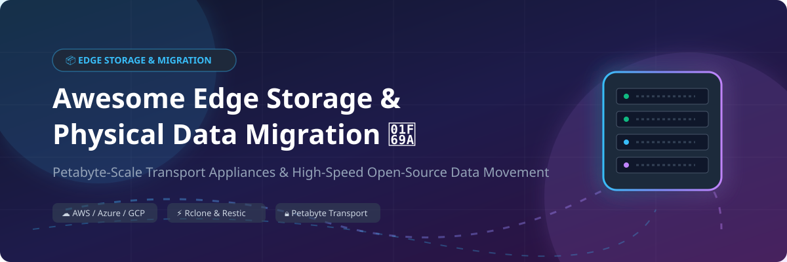

# Awesome Edge Storage & Physical Data Migration 📦 🚚 ⚡

  

  
  
  
  
  
  

---

## 🌟 Top Edge Storage & Physical Data Migration Ecosystem 🚀

**Curated Directory of Commercial Data Transport Appliances, Hyperscaler Snowball Devices & High-Performance Open-Source Data Movement Tools** 📦 🌐

*Focused on Petabyte-Scale Physical Data Migration, Offline Storage Appliances, WAN File Transfer Acceleration, Tape Archive Systems & Self-Hosted Object Storage Sync* 🗄️ ⚡

**Last updated: October 2026** 📅

---

### 📌 Overview & SEO Summary 🔍

Welcome to the ultimate curated resource for **edge storage appliances**, **physical data transport hardware**, **open-source file movement tools**, and **petabyte-to-exabyte migration frameworks**. Whether migrating multi-terabyte datasets to hyperscaler cloud environments (*AWS Snowball Edge*, *Azure Data Box*, *Google Cloud Transfer Appliance*), accelerating enterprise WAN throughput (*IBM Aspera*, *Signiant*, *Resilio Connect*), or orchestrating zero-downtime open-source data sync (*Rclone*, *Syncthing*, *Restic*, *SeaweedFS*, *Chorus*), this repository provides authoritative technical specifications, pricing metrics, free tier capabilities, and deployment architecture guidance. 💻 🛡️

**Key Market Insights:**
- **AWS Snowball Edge**: Up to **80 TB usable** capacity per device (Storage Optimized); **Snowmobile** scales up to **100 PB** per truck. 🚛
- **Azure Data Box**: Up to **100 TB usable** per appliance; **Data Box Heavy** scales up to **1 PB** per job. 🔷
- **Google Cloud Transfer Appliance**: Offers **40 TB** and **300 TB** rackable appliances with per-day rental options and included free trial shipping windows. 🌐
- **Open-Source Data Sync**: Tools like **Rclone** (70+ cloud providers supported) and **Restic** deliver enterprise-grade encrypted migration with zero license fees. 🔄

---

## 📑 Table of Contents 📖

- [🏢 SaaS & Commercial Platforms](#-saas--commercial-platforms)
- [🔓 Open-Source GitHub Projects](#-open-source-github-projects)
- [🛠️ How to Contribute](#%EF%B8%8F-how-to-contribute)
- [📊 Star History](#-star-history)
- [🤝 Support & Sponsorship](#-support--sponsorship)
- [⚠️ Disclaimer](#%EF%B8%8F-disclaimer)

---

## 🏢 SaaS / Commercial Platforms 🏬

> **Market Size & Structure:**  
> The global **Edge Storage and Data Transport Market** is estimated at **$12.5 Billion in 2026** and projected to reach **$31.8 Billion by 2030** (CAGR 20.4%). The market is **highly concentrated (Oligopoly / Winner-Take-All)** among hyperscalers (Amazon AWS, Microsoft Azure, Google Cloud) for physical appliance transport, while remaining **moderately fragmented** in enterprise WAN acceleration and hybrid cloud data management (Signiant, IBM Aspera, Resilio, Scality). 📈 🌐

*Sorted by Valuation / Market Cap (Descending)* 📊

| SaaS / Commercial Platform | Company / Owner | Valuation / Market Cap | Standard Edition Starting Price | Free Tier / Free Trial Limits | Description |
| :--- | :--- | :--- | :--- | :--- | :--- |
| **[Azure Data Box](https://azure.microsoft.com/en-us/products/databox/)** 🔷 | Microsoft | **~$3.90 Trillion** | **$100/device** (Disk) / **$300/job** (100TB) + **$0.03/GB** | **No free tier** (hardware service excluded from Azure Free Tier; $15/day after 10 included days) | **Azure-native physical migration** — **Data Box**: **100 TB usable capacity** . **Data Box Heavy**: **1 PB usable capacity** . **Data Box Disk**: **8 TB per disk, up to 5 disks** . **Ruggedized, encrypted, and tamper-resistant** . **Integrates with Azure Storage and Blob** . |
| **[AWS Snowball Edge](https://aws.amazon.com/snowball/)** ☁️ | Amazon | **~$2.0 Trillion** | **$300/job** (Storage Opt.) + **$0.03/GB** data transfer fee | **No free tier** (hardware service excluded from AWS Free Tier; $30/day after 10-15 included days) | **AWS-native physical migration** — **Snowball Edge Storage Optimized**: **80 TB usable capacity**, **40 vCPUs**, **80 GB RAM** . **Snowball Edge Compute Optimized**: **42 TB usable**, **52 vCPUs**, **208 GB RAM**, **optional GPU** . **Snowmobile**: **up to 100 PB** for exabyte-scale migrations . **Ruggedized, tamper-resistant, and encrypted** . |
| **[Google Cloud Transfer Appliance](https://cloud.google.com/transfer-appliance/)** 🌐 | Google (Alphabet) | **~$2.0 Trillion** | **$300 base fee** (7TB/40TB) or **$1,800** (300TB) + **$10–$90/day** rental | **Free trial days included: 30 days free (7TB), 10 days free (40TB), 25 days free (300TB)** | **GCP-native physical migration** — **Rackable appliance** for **offline data transfer** . **7 TB, 40 TB, and 300 TB configurations** . **Per-day rental after free period** . **Shipping costs start ~$120–$550 round-trip** . |
| **[IBM Aspera](https://www.ibm.com/products/aspera)** 🚀 | IBM | **~$200 Billion** | **$0.95/GB** (On-Demand SaaS) or **$12,500/year** (100 Mbps server license) | **30-day free trial** with 1 TB high-speed transfer limit | **High-speed FASP protocol transfer** — **Patented transfer acceleration** for large files over WAN . **Editions scale by transfer volume** . **The gold standard for high-speed WAN transfer** . |
| **[Iron Mountain Data Transport](https://www.ironmountain.com/)** 🏔️ | Iron Mountain | **~$10 Billion** | **$250/job base rate** + transport volume fees | **No free tier or trial** (quote required for enterprise transport & vaulting) | **Physical data transport and archiving** — **Secure chain-of-custody transport** for physical media . **Tape and disk migration services** . **The most trusted physical data transport provider** . |
| **[Quantum StorNext](https://www.quantum.com/)** ⚛️ | Quantum | **~$500 Million** | **$10,000/year base software subscription** | **No free tier** (30-day evaluation license available) | **High-performance file system and archive** — **Shared storage for media and entertainment** . **Scalable to petabytes** . **Integrated with tape and object storage** . |
| **[Signiant](https://www.signiant.com/)** 📡 | Signiant Inc. | **Private (~$350 Million)** | **$13,000/year** (Small Business Tier) | **No free tier** (30-day evaluation trial available upon sales request) | **Media and entertainment data transfer** — **SaaS platform with no bandwidth caps** . **Professional tier includes 25 TB cloud payload transfers** . **Used by 50,000+ media companies** . |
| **[Resilio Connect](https://www.resilio.com/)** ⚡ | Resilio Inc. | **Private (~$200 Million)** | **$7,500/year** (Resilio Active Everywhere / Connect) | **14-day free trial** with full feature access and unlimited data transfer evaluation | **Peer-to-peer file synchronization** — **Uses BitTorrent protocol for accelerated multi-site transfer** . **No bandwidth caps** . **Supports hybrid cloud and edge deployments** . **The most efficient WAN acceleration platform** . |
| **[Scality RING](https://www.scality.com/)** 🏗️ | Scality | **Private (~$150 Million)** | **$0.01/GB/month** software subscription (500TB minimum entry point) | **30-day free trial** (Scality ARTESCA / RING software trial) | **Software-defined object storage** — **S3-compatible** . **Scales to exabytes** . **Designed for cloud-native applications and data archiving** . |
| **[Spectra Logic BlackPearl](https://spectralogic.com/)** 🎞️ | Spectra Logic | **Private (~$100 Million)** | **$15,000 appliance base price** (80TB initial capacity) | **No free tier** (guided interactive demo and lab proof-of-concept available) | **On-premises digital archive** — **Ransomware-resilient** with virtual air gaps . **Scales to 6.4 exabytes** with TFinity Plus tape libraries . **NAS, S3, and tape interfaces** . |

---

## 🔓 Open-Source GitHub Projects 💻

*Sorted by GitHub_Stars_Count (Descending)* 🌟

- **[Syncthing](https://github.com/syncthing/syncthing)**   
  **Continuous peer-to-peer file synchronization**, MPL-2.0 licensed. **60K+ GitHub_Stars** — **decentralized, no central server** . **TLS encryption, versioning, and conflict resolution** . **The most popular open-source P2P sync tool** . 📂

- **[Rclone](https://github.com/rclone/rclone)**   
  **The Swiss army knife of cloud storage sync**, MIT licensed. **50K+ GitHub_Stars** — **supports 70+ cloud storage providers** with a unified CLI . **Sync, copy, move, mount (FUSE), and serve (HTTP/WebDAV/FTP)** . **Bandwidth limiting, checksum verification, and incremental transfers** . **The de facto standard for open-source data migration** . 🔄

- **[Restic](https://github.com/restic/restic)**   
  **Fast, secure, efficient backup program**, BSD-2-Clause licensed. **28K+ GitHub_Stars** — **single binary with no dependencies** . **Supports S3, GCS, Azure, B2, SFTP, REST, and local storage** . **Deduplication, encryption, and incremental snapshots** . **The standard for open-source backup and migration** . ⚡

- **[SeaweedFS](https://github.com/seaweedfs/seaweedfs)**   
  **Fast distributed storage system for blobs, objects, and files**, Apache-2.0 licensed. **24K+ GitHub_Stars** — **handles billions of small files efficiently with POSIX & S3 API support** . **Built-in active-active data replication and tiering to cloud storage** . **Ideal for edge-to-cloud data migration** . 🌊

- **[MinIO](https://github.com/minio/minio)**   
  **High-performance Kubernetes-native object storage**, AGPL-3.0 licensed. **22K+ GitHub_Stars** — **S3 API compatible object storage built for cloud-native data migration and edge caching** . **Supports active-active multi-site replication** . ⚡

- **[BorgBackup](https://github.com/borgbackup/borg)**   
  **Deduplicating backup and sync**, BSD-3-Clause licensed. **12K+ GitHub_Stars** — **efficient deduplication and compression** . **Encrypted, authenticated backups** . **Mountable archives via FUSE** . **The most efficient deduplicating backup tool** . 🗜️

- **[Duplicati](https://github.com/duplicati/duplicati)**   
  **Encrypted backup to cloud storage**, LGPL-2.1 licensed. **11K+ GitHub_Stars** — **stores encrypted, incremental, compressed backups** to 20+ cloud providers . **AES-256 encryption, scheduled backups, and web-based UI** . 🔐

- **[OpenZFS](https://github.com/openzfs/zfs)**   
  **Advanced file system and volume manager**, CDDL-1.0 licensed. **11K+ GitHub_Stars** — **data integrity, snapshots, and replication** . **`zfs send` and `zfs receive` for efficient physical migration** . **The most robust open-source storage platform** . 🗄️

- **[Kopia](https://github.com/kopia/kopia)**   
  **Fast and secure backup/sync tool**, Apache-2.0 licensed. **8K+ GitHub_Stars** — **client-side end-to-end encryption, deduplication, and compression** . **Snapshot-based with policy-driven retention** . **Supports cloud, NAS, and local storage** . 🛡️

- **[restic WebUI (Backrest)](https://github.com/garethgeorge/backrest)**   
  **Web UI and orchestrator for restic backup**, GPL-3.0 licensed. **4K+ GitHub_Stars** — **web-based management for restic** . **Scheduled backups, retention policies, and multi-repo support** . **The easiest way to use restic** . 🌐

- **[rsync](https://github.com/RsyncProject/rsync)**   
  **The classic incremental file transfer tool**, GPL-3.0 licensed. **3K+ GitHub_Stars** — **foundational delta-transfer algorithm** — **only sends differences between source and destination** . **Nearly 30 years of production use** . 📦

- **[Unison](https://github.com/bcpierce00/unison)**   
  **Bi-directional file synchronization**, GPL-3.0 licensed. **2K+ GitHub_Stars** — **synchronizes in both directions with conflict detection** . **Works across platforms** . **Handles network interruptions gracefully** . 🔁

- **[Chorus](https://github.com/clyso/chorus)**   
  **Distributed, vendor-agnostic object storage migration and routing**, Apache-2.0 licensed. **1K+ GitHub_Stars** — **enables faster transfers between S3-compatible storages** using multiple machines . **Resumable transfers with checkpointing** . **Reduces migration downtime to zero** . 🎯

- **[s3ql](https://github.com/s3ql/s3ql)**   
  **Full-featured file system for online data storage**, GPL-3.0 licensed. **1K+ GitHub_Stars** — **stores all data online** using S3, Google Storage, or OpenStack . **Compression, encryption, data de-duplication, immutable trees, and snapshotting** . 💾

---

## 🛠️ How to Contribute 🤝

Contributions are welcome! Follow these steps to submit new edge storage platforms or open-source data migration software: 🚀

1. 🍴 **Fork** the repository.
2. 📝 **Add/edit** entries in `README.md` maintaining table/list structure and formatting.
3. 🔗 Include project title, official website/GitHub link, exact Stars_Count badge, license, and brief description.
4. 🚀 Submit a **Pull Request** with a descriptive summary of your changes.

---

## 📊 Star History 📈

---

## 🤝 Support & Sponsorship ☕

If you find this edge storage and physical data migration repository useful, please consider supporting the project:

- ⭐ **Star** this repository to increase visibility!
- 🔀 **Fork** and share with fellow storage engineers, data migration specialists, and open-source advocates.
- ☕ **Sponsor & Buy Me a Coffee**: Support ongoing open-source curation via the [GitHub Sponsor Dashboard](https://github.com/sponsors/ishandutta2007).

---

## ⚠️ Disclaimer ℹ️

- This is a **community-curated** list — not exhaustive and not an official endorsement. ℹ️
- **AWS Snowball Edge delivers 80 TB usable per device**; **Snowmobile supports up to 100 PB** . **Azure Data Box offers 100 TB usable**; **Data Box Heavy at 1 PB** . **Google Transfer Appliance provides 40 TB or 300 TB configurations** with **per-day rental pricing** . 🚚
- **Physical migration is cost-effective above 10 TB** — below that, network transfer is usually cheaper. **Model your data volume, timeline, and network bandwidth** before committing to a physical appliance. 📊
- **Open-source data migration tools (Rclone, Restic, Chorus, SeaweedFS) are not turnkey** — they require **deployment, network configuration, and ongoing maintenance** . **Rclone requires provider credentials** . **Chorus requires multiple machines for parallel transfer** . **Always validate data integrity after migration** with checksums before deleting source data . 📦

---

  <b>Made with ❤️ for storage engineers, data migration specialists, and open-source data movement advocates.</b>

